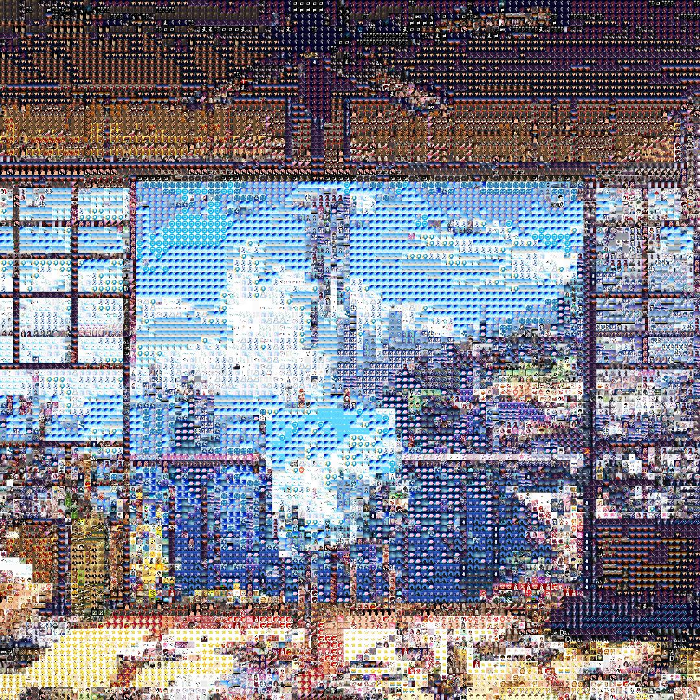

# mosaic

功能：通过对图片进行分割和替换，实现图片马赛克化

(由于没有找到合适的纯色贴图，而需求的贴图质量要求并不高，于是从一个深度学习的训练图片集中选取一部分来作为贴图)。

## 如何启动？

- 安装 Golang
- 把程序 clone 到本地
- 编译运行
- 在 localhost:8090 上传图片，等待服务器处理返回

```
git clone https://github.com/sky-yang-high/mosaic
cd mosaic
go build && ./mosaic
```

### 替换贴图

打开 ./mosaic/tiles，这里的图片就是贴图文件。可以根据喜好找一些合适的贴图并重新编译程序即可。

### 效果图

| 原图                                                    | 效果图                                                       |
| ------------------------------------------------------- | ------------------------------------------------------------ |
|                                    |                                   |
|  |  |

## 实现

- 通过简单的 HTML 渲染网页
- 服务器初始化时，从 tiles 中读取全部的图片，计算整张图片的平均 RGB，保存于 db 中
- 接收到图片后，把图片分割为合适大小的小块，计算其平均 RGB ，并在 db 中找一个与之最接近的 图片，进行替换。
- 合并所有的小块作为整个图片，返回给客户端

### 优化

分析上面的处理过程，可以发现主要的时间限制在对图片的处理过程中。引出下面两种优化思路：

1. 优化处理过程。go 天生就易于并发，考虑并发处理图片。把整个图片再分为 4 个较小的图片，对这 4 个小图片进行分割与替换，然后再合并替换后的图片。

   使用 goroutine 并发处理，使用 channel 来通知调用方处理完毕。。

2. 优化查找替换块过程。原本的查找思路是遍历整个 db，比较每个 {r,g,b} 三元组与要被替换块的 {r,g,b} 的差异，选择差异最小的进行替换。

   这个思路对每个替换块都要遍历一次 db，显然是非常低效的。而且我们并不需要精确的最接近的贴图，只需要一个相对接近的即可。于是可以使用 KDTree，把 db 重构为一个 kdtree，每次查找时无需遍历整个 db。


